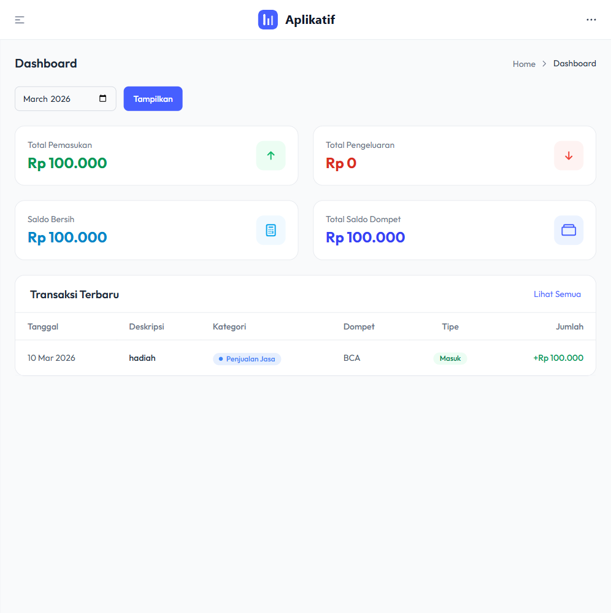

# Aplikatif Keuangan Dasar

Aplikasi manajemen keuangan pribadi/usaha sederhana berbasis web, dibangun dengan **Laravel 12** dan **TailAdmin**. Mendukung pencatatan pemasukan & pengeluaran, manajemen dompet, kategori transaksi, laporan bulanan, serta sistem role & permission.



## Fitur Utama

- **Dashboard** — Ringkasan keuangan bulanan (pemasukan, pengeluaran, saldo bersih, total dompet) dengan tabel transaksi terbaru
- **Transaksi** — Catat pemasukan dan pengeluaran dengan kategori, dompet, dan deskripsi
- **Dompet** — Kelola beberapa dompet/rekening (misal: BCA, Cash, dll)
- **Kategori** — Atur kategori transaksi sesuai kebutuhan
- **Laporan** — Lihat laporan keuangan per periode
- **Manajemen Pengguna** — CRUD user dengan role-based access control
- **Role & Permission** — Pengaturan hak akses menggunakan Spatie Permission
- **Pengaturan** — Konfigurasi aplikasi (nama, logo, tema, PWA)
- **Log Aktivitas** — Riwayat semua perubahan data oleh pengguna
- **PWA** — Progressive Web App, bisa diinstall di perangkat mobile

## Tech Stack

| Layer | Teknologi |
|-------|-----------|
| Backend | Laravel 12, PHP 8.2+ |
| Frontend | Tailwind CSS v4, Alpine.js, Vite |
| Template | TailAdmin |
| Database | MySQL (InnoDB) |
| Auth | Custom authentication dengan throttling |
| Authorization | Spatie Laravel Permission v7 |
| Activity Log | Spatie Laravel Activitylog v4 |
| Image Processing | Intervention Image v3 |
| Testing | Pest (unit/feature), Playwright (E2E) |

## Prasyarat

- PHP 8.2+
- Composer
- Node.js 18+ & npm
- MySQL 8.0+

## Instalasi

```bash
# 1. Clone repository
git clone https://github.com/lumbunginov/aplikatif_keuangan_dasar.git
cd aplikatif_keuangan_dasar

# 2. Install dependencies
composer install
npm install

# 3. Setup environment
cp .env.example .env
php artisan key:generate
```

Konfigurasi database di `.env`:

```env
DB_CONNECTION=mysql
DB_HOST=127.0.0.1
DB_PORT=3306
DB_DATABASE=aplikatif_base
DB_USERNAME=root
DB_PASSWORD=
```

```bash
# 4. Migrasi & seed database
php artisan migrate --seed

# 5. Link storage
php artisan storage:link

# 6. Build assets
npm run build
```

## Menjalankan Aplikasi

```bash
# Development (server + queue + logs + vite sekaligus)
composer run dev

# Atau manual:
php artisan serve    # Laravel server di http://localhost:8000
npm run dev          # Vite HMR
```

## Akun Default

| Email | Password | Role |
|-------|----------|------|
| admin@aplikatif.com | password | Superadmin |

## Testing

```bash
# Unit & Feature test
composer run test

# E2E test (pastikan server berjalan di :8000)
npx playwright test
```

## Struktur Role & Permission

Terdapat 3 role bawaan: **Superadmin**, **Admin**, dan **Staff**. Setiap permission mengikuti format `verb resource`, contoh:

- `view users`, `create users`, `edit users`, `delete users`
- `view transactions`, `create transactions`, dst.

## Lisensi

MIT License

## Kontribusi

Pull request dan issue sangat diterima. Silakan fork repository ini dan buat branch baru untuk fitur atau perbaikan yang ingin ditambahkan.
